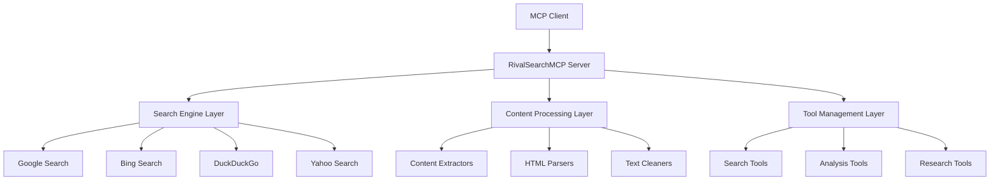

# System Architecture 🏗️

**Understanding How RivalSearchMCP Works**

This guide explains the high-level architecture of RivalSearchMCP from a user and integrator perspective, helping you understand how to best utilize the system.

## 🎯 System Overview

RivalSearchMCP is built as a **modular, scalable architecture** that provides search and content analysis capabilities through a clean MCP interface.

## 🔍 Core Components

### **Search Engine Layer**
The search engine layer provides **unified access** to multiple search providers:

- **Google Search** - Primary search with anti-detection
- **Bing Search** - Microsoft's search engine
- **DuckDuckGo** - Privacy-focused search
- **Yahoo Search** - Comprehensive web search

**Key Benefits:**
- **Fallback Strategy** - If one engine fails, others continue
- **Rate Limiting** - Prevents API abuse
- **Result Deduplication** - Clean, unique results

### **Content Processing Layer**
Advanced content extraction and processing capabilities:

- **6-Tier Fallback System** - Multiple extraction methods
- **Multi-Level Link Following** - Deep content discovery
- **Content Cleaning** - Markdown conversion and optimization
- **Rich Snippet Detection** - Enhanced result analysis

### **Tool Management Layer**
MCP tool registration and management:

- **Dynamic Tool Loading** - Tools loaded at runtime
- **Context Management** - Progress reporting and error handling
- **Tool Validation** - Input validation and sanitization

## 🚀 Performance Architecture

### **Asynchronous Processing**
- **Concurrent Operations** - Multiple searches run simultaneously
- **Non-blocking I/O** - Server remains responsive during operations
- **Resource Pooling** - Efficient connection management

### **Caching Strategy**
- **LRU Cache** - Frequently accessed results cached
- **Result Caching** - Search results cached for performance
- **Content Caching** - Extracted content cached locally

### **Rate Limiting**
- **Per-Engine Limits** - Different limits for each search engine
- **Burst Handling** - Graceful handling of traffic spikes
- **Queue Management** - Request queuing during high load

## 🔧 Integration Points

### **MCP Protocol**
- **Standard Compliance** - Full MCP specification support
- **Tool Discovery** - Dynamic tool listing and registration
- **Progress Reporting** - Real-time operation status

### **HTTP Transport**
- **RESTful API** - Standard HTTP endpoints
- **WebSocket Support** - Real-time communication
- **CORS Configuration** - Cross-origin resource sharing

### **Authentication & Security**
- **API Key Management** - Secure access control
- **Rate Limiting** - Abuse prevention
- **Input Validation** - Security against malicious input

## 📊 Scalability Features

### **Horizontal Scaling**
- **Stateless Design** - Multiple instances can run simultaneously
- **Load Balancing** - Distribute requests across instances
- **Shared Caching** - Redis or similar for distributed caching

### **Vertical Scaling**
- **Resource Optimization** - Efficient memory and CPU usage
- **Connection Pooling** - Optimized network connections
- **Async Processing** - Non-blocking operations

### **Database Scaling**
- **Result Storage** - Efficient storage of search results
- **Analytics** - Performance and usage metrics
- **User Management** - Multi-tenant support

## 🛡️ Reliability Features

### **Error Handling**
- **Graceful Degradation** - System continues with reduced functionality
- **Automatic Retry** - Failed operations retried automatically
- **Fallback Strategies** - Alternative approaches when primary fails

### **Monitoring & Alerting**
- **Performance Metrics** - Response time and throughput
- **Error Tracking** - Detailed error logging and reporting
- **Health Checks** - System health monitoring

### **Backup & Recovery**
- **Data Backup** - Regular backup of configuration and data
- **Disaster Recovery** - Quick recovery from failures
- **Configuration Management** - Version-controlled configuration

## 🔗 External Dependencies

### **Search Engines**
- **Google** - Primary search provider
- **Bing** - Microsoft search integration
- **DuckDuckGo** - Privacy-focused search
- **Yahoo** - Comprehensive web search

### **Content Processing**
- **BeautifulSoup** - HTML parsing and extraction
- **Selectolax** - Fast HTML parsing
- **Cloudscraper** - Anti-detection measures

### **Infrastructure**
- **FastMCP** - MCP protocol implementation
- **HTTPX** - Async HTTP client
- **Asyncio** - Asynchronous programming support

## 🎯 Best Practices

### **For System Administrators**
1. **Monitor Resource Usage** - Track CPU, memory, and network
2. **Configure Rate Limits** - Set appropriate limits for your environment
3. **Implement Caching** - Use Redis or similar for performance
4. **Set Up Monitoring** - Implement comprehensive monitoring

### **For Developers**
1. **Use Async Patterns** - Leverage async/await for performance
2. **Implement Error Handling** - Always handle potential failures
3. **Cache Results** - Cache frequently accessed data
4. **Monitor Performance** - Track response times and throughput

### **For Integrators**
1. **Respect Rate Limits** - Don't overwhelm the system
2. **Implement Retry Logic** - Handle temporary failures gracefully
3. **Use Connection Pooling** - Reuse connections when possible
4. **Monitor API Usage** - Track your API consumption

## 🔗 Related Documentation

- [Installation Guide](../getting-started/installation.md)
- [Overview](../user-guide/overview.md)

---

**Need help with architecture decisions?** [Open an issue](https://github.com/rivalsearchmcp/rivalsearchmcp/issues) on GitHub!
